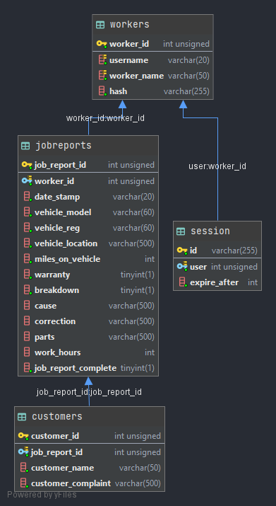

# Repota

A CRUD web app for automobile technicians to manage service reports, reducing report preparation time by 25%.


## Services

- **Repota**: Angular/Ionic frontend. Registration, login, and report create/edit/export/delete, talking to Horton over REST. See the [user guide](https://github.com/johnshields/repota/wiki/Repota-Guide) for a walkthrough.
- **Horton**: Go/Gin REST API backend. Authentication, sessions, and report CRUD against MySQL, plus vehicle make/model lookups via the Back4App API. See the [API documentation](https://johnshields.github.io/horton.api.doc/) for endpoint details.

## Database

MySQL, four tables: `workers`, `jobreports`, `customers`, `session`.



## Running the Project

### Stack

- Frontend: Angular, Ionic, TypeScript. Unit tests with Karma/Jasmine, BDD tests with Cucumber/Selenium.
- Backend: Go, Gin, MySQL. Unit tests with Go's testing package and testify.
- OpenAPI 3.0 spec, Docker.

### 1. Set up the database

Start MySQL, then run the numbered scripts in [api/db](https://github.com/johnshields/repota/tree/main/api/db) in order.

### 2. Configure the backend

```bash
cp api/go/config/config.ini.example api/go/config/config.ini
```

Add your MySQL and [Back4App](https://www.back4app.com/database/back4app/car-make-model-dataset) details.

### 3. Start the backend

```bash
cd api
go run main.go
```

### 4. Start the frontend

```bash
cd app
npm install
npm start
```

## License

[MIT](LICENSE)

###### Originally built as a BSc (Hons) Software Development [dissertation](https://github.com/johnshields/repota/blob/main/.assets/dissertation/dissertation.pdf) project at GMIT (71%).
